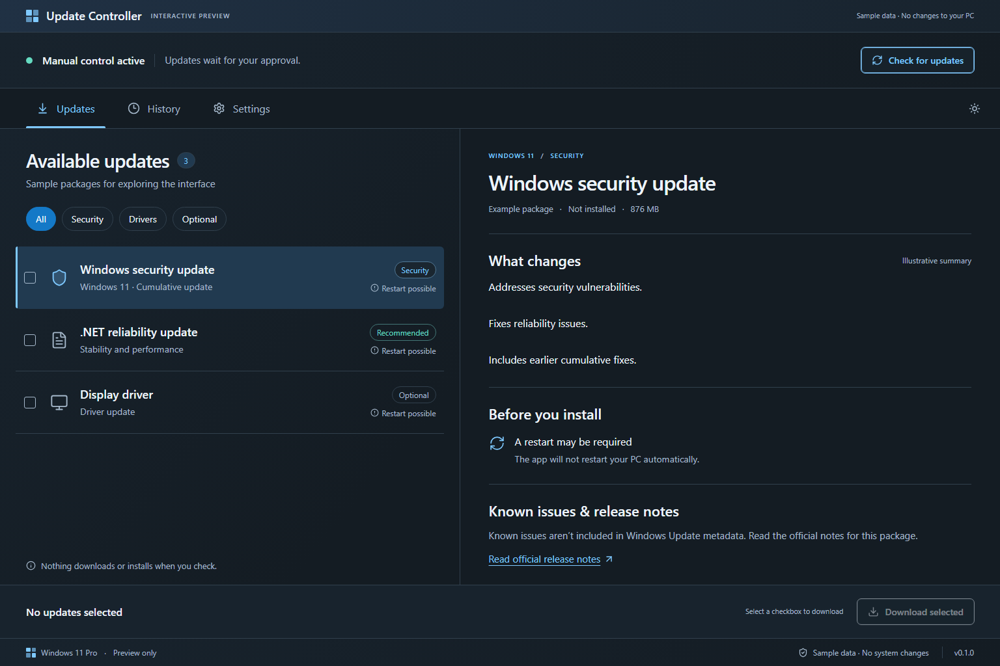

# Update Controller

A Windows desktop app for understanding available updates and deliberately choosing when to download and install them. Built with Tauri 2, React, TypeScript, and a .NET Windows Update Agent helper.



## License and use at your own risk

Licensed under the [MIT License](LICENSE). The software is provided **as is, without warranty**. To the extent permitted by applicable law, the authors and copyright holders disclaim liability for claims, damages, or other liability arising from its use.

This app changes Windows Update policy and can download and install system updates. Use it at your own risk: changes can cause instability, data loss, or reduced security if updates are deferred. Keep backups and review the [validation limitations](docs/VALIDATION.md) before use. There is no guarantee that the app will prevent every automatic update or restart. Third-party components retain their own licenses.

## Run

Download the installer and checksum from the [latest GitHub release](https://github.com/kenhaesler/win-update-controller/releases/latest). Rebuilding produces `src-tauri/target/release/bundle/nsis/Update Controller_0.1.1_x64-setup.exe`. Install it and open **Update Controller** from Start. Installation goes to Program Files and requires administrator access. The UI itself runs unelevated. This development release is unsigned.

1. Open **Settings** and inspect the current policy and pending-restart status.
2. Choose **Enable manual mode** to back up the current policy and configure manual updating.
3. **Check for updates** retrieves metadata only; it never calls download or installation APIs.
4. Open a package to read its description, restart requirement, and official Microsoft notes.
5. Select checkboxes and **Download selected**. Review packages and any license terms.
6. Select downloaded packages and choose **Review installation**. Installation is a separate deliberate action. The app never initiates a restart.

Closing the window during an operation keeps it running in the tray. Results are recorded before returning to the UI. If a process fails, inspect History and perform a fresh check before retrying; an unfinished journal is shown as uncertain, not successful.

## Implemented

- Graphite and light themes matching the approved mockup; master-detail and compact navigation, keyboard focus, reduced motion.
- Real Windows Update Agent scans: identity/revision, descriptions, download state, classifications, bundled components, and restart requirements.
- Read-only status and the latest 100 Windows history entries.
- Microsoft release-note extraction, KB-title matching, safe plain-text rendering, dated local cache, and explicit missing-data states.
- Separate reviewed downloads and installations, exact identity/revision revalidation, changed-review rejection, license review, exclusive-install checks, and per-package outcomes.
- Backed-up `NoAutoUpdate` changes, conflict detection, readback, crash-recoverable restoration, and preservation of externally changed values.
- Authenticated broker/worker IPC and serialized privileged operations. No generic shell or registry commands exposed to the frontend.
- Tray access and an NSIS uninstall choice to restore previous policy or retain manual mode. Upgrades and silent uninstalls retain policy.

## Validation boundaries

See [VALIDATION.md](docs/VALIDATION.md). The user accepted delivery without a disposable Windows VM.

**Actual policy application, UAC worker execution, installation, reboot behavior, and installer upgrade/uninstall behavior have not been exercised on a disposable system.** Development tests did not download or install updates or change this PC's Windows Update policy. The app reports policy configuration and agent state; it does not claim certified prevention of future forced updates.

Manual mode cannot undo an update already staged for restart. Cumulative fixes are indivisible packages. Managed PCs and policy conflicts are blocked from enabling manual mode. Store apps, third-party updaters, independent firmware tools, and separate Defender intelligence paths are outside this policy's complete control. Windows can change policy behavior between builds.

## Develop

Prerequisites: Windows x64, Node.js, Rust with MSVC build tools, .NET 8 SDK or newer capable of targeting .NET 8, and WebView2. The installer bundles the helper runtime; end users do not need the .NET SDK.

```powershell
npm ci
npm run desktop:dev
```

`npm run dev` starts a labelled browser preview with sample packages and simulated actions. It cannot modify Windows. Native runs use the real helper and never silently substitute sample data when it fails.

```powershell
npm run desktop:build
npm test
npm run test:e2e
dotnet run --project native/UpdateController.Tests
```

Install Chromium for browser tests once with `npx playwright install chromium`.

## Structure and data

- `src/`: React interface, typed adapter, preview fixtures, source reader, semantic theme tokens.
- `src-tauri/`: desktop shell, constrained routing, link validation, tray and installer.
- `native/UpdateController.Helper/`: COM, policy transaction engine, elevation, source extraction.
- `native/UpdateController.Tests/`: isolated tests with a fake policy store; no Windows mutations.
- `tests/`: browser workflow, resilience, keyboard, and accessibility checks.

Caches and theme preferences live in local WebView storage. Policy backup and last privileged operation live under `HKLM\SOFTWARE\UpdateController`, with normal administrator-write registry permissions. The only automatic-update value written is `HKLM\SOFTWARE\Policies\Microsoft\Windows\WindowsUpdate\AU\NoAutoUpdate`.

Use Restore previous policy in Settings or choose restoration during interactive uninstall. Restoration refuses to overwrite externally changed values. Policy and recovery records are retained when uninstalling to preserve recovery evidence. No telemetry, cloud account, or API key is required.
